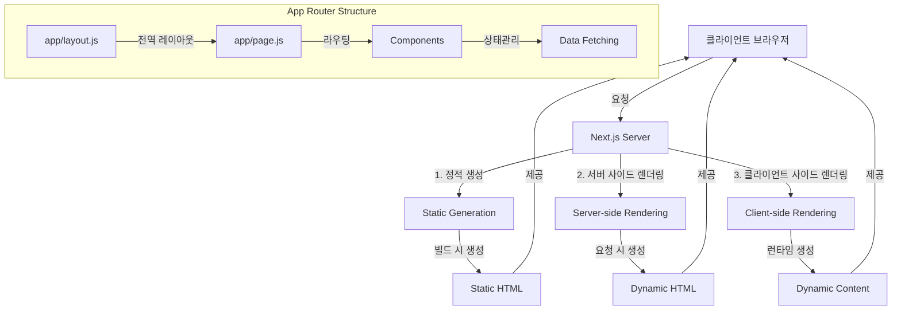

## First Next.js Tutorial (version 15)
- 이 튜토리얼은 코딩애플의 [next.js 13 강의](https://www.youtube.com/watch?v=PCkiz2GUFg8)를 보고 15버전 기준으로 정리한 내용
- sveltkit, vue를 경험하고, next.js를 배워보는 시간을 가져보기 위해서 기초를 다지고, 실 프로젝트는 따로 repository를 만들어서 진행할 예정

### 1. 프로젝트 초기 설정
- conda를 기반으로 프로젝트를 진행할 예정
- 프로젝트 폴더 생성 후, 터미널을 열고 아래 명령어를 입력
    ```
    conda create -n next13
    ```
- 프로젝트 폴더로 이동 후, 아래 명령어를 입력
    ```
    conda activate next13
    conda install -c conda-forge nodejs=20
    npx create-next-app@latest tutorial
    ```
    ```bash
     npx create-next-app@latest tutorial          
    ✔ Would you like to use TypeScript? … No
    ✔ Would you like to use ESLint? … No 
    ✔ Would you like to use Tailwind CSS? … Yes
    ✔ Would you like your code inside a `src/` directory? … No
    ✔ Would you like to use App Router? (recommended) … Yes
    ✔ Would you like to use Turbopack for next dev? … No
    ✔ Would you like to customize the import alias (@/* by default)? … No
    Creating a new Next.js app in /Users/skyriver228/Documents/project/next-js-13-tut/tutorial.

    Using npm.

    Initializing project with template: app-tw 


    Installing dependencies:
    - react
    - react-dom
    - next

    Installing devDependencies:
    - postcss
    - tailwindcss
    ```
    - App Router(앱 라우터) <- recommended
        - Next.js 13부터 도입된 새로운 라우팅 시스템
        - SvelteKit의 파일 기반 라우팅과 유사하게, 폴더 구조가 곧 URL 구조
        - pages 디렉토리 대신 app 디렉토리를 사용하며, 이는 더 직관적인 구조를 제공
    - 
- 프로젝트 폴더(`tutorial`) 내에서 아래 명령어를 입력
    ```
    npm install
    ```
- 프로젝트 실행
    ```
    npm run dev
    ```
### 2. Next.js에 대한 기본적인 이해

- Next.js의 특징
    - "Server Components(서버 컴포넌트)": 기본적으로 모든 컴포넌트가 서버에서 실행
    - "React Server Components(리액트 서버 컴포넌트)": SvelteKit의 서버 사이드 렌더링과 비슷하지만, 더 세밀한 제어가 가능
    - "Streaming(스트리밍)": 데이터를 점진적으로 로드 가능
    ```mermaid
    graph "렌더링 프로세스"
        G[페이지 요청] --> H{렌더링 방식}
        
        H -->|SSR| I[서버 사이드 렌더링]
        H -->|CSR| J[클라이언트 사이드 렌더링]
        H -->|SSG| K[정적 생성]
        
        I --> L[서버에서 HTML 생성]
        J --> M[브라우저에서 렌더링]
        K --> N[빌드 시 HTML 생성]
        
        L --> O[클라이언트에 전달]
        M --> O
        N --> O
    end
    ```
    - SSR: 서버 사이드 렌더링 
        - 각 요청마다 서버에서 페이지를 생성
    - CSR: 클라이언트 사이드 렌더링 
        - "use client" 지시문을 사용하여 명시적으로 선언
        - 브라우저에서 JavaScript가 실행되어 렌더링
- Next.js 13 → 15 주요 변경사항:
    - "Turbopack(터보팩)"이 더욱 안정화
    - 서버 액션이 정식으로 도입
    - "Partial Prerendering(부분 사전 렌더링)"이 새롭게 도입
- SvelteKit과 비교
    - 둘다, 폴더 구조가 곧 URL 구조
    - SvelteKit은 파일 기반 라우팅, Next.js는 앱 라우터
    - `+page.svelte` 대신 `page.js`, `+layout.svelte` 대신 `layout.js`
        - `layout`은 `page`를 감싼다.
    - `app.css` 대신 `globals.css`: 전역 스타일 정의